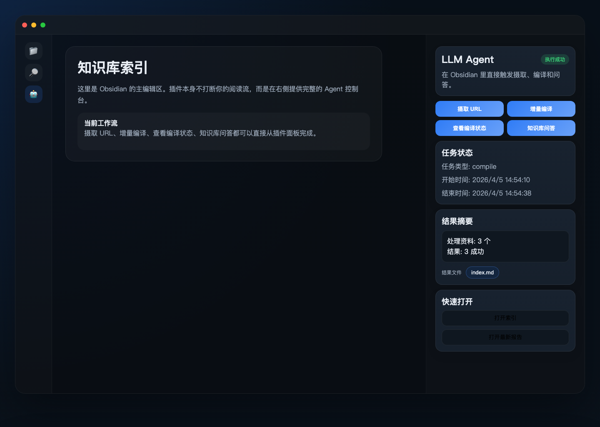
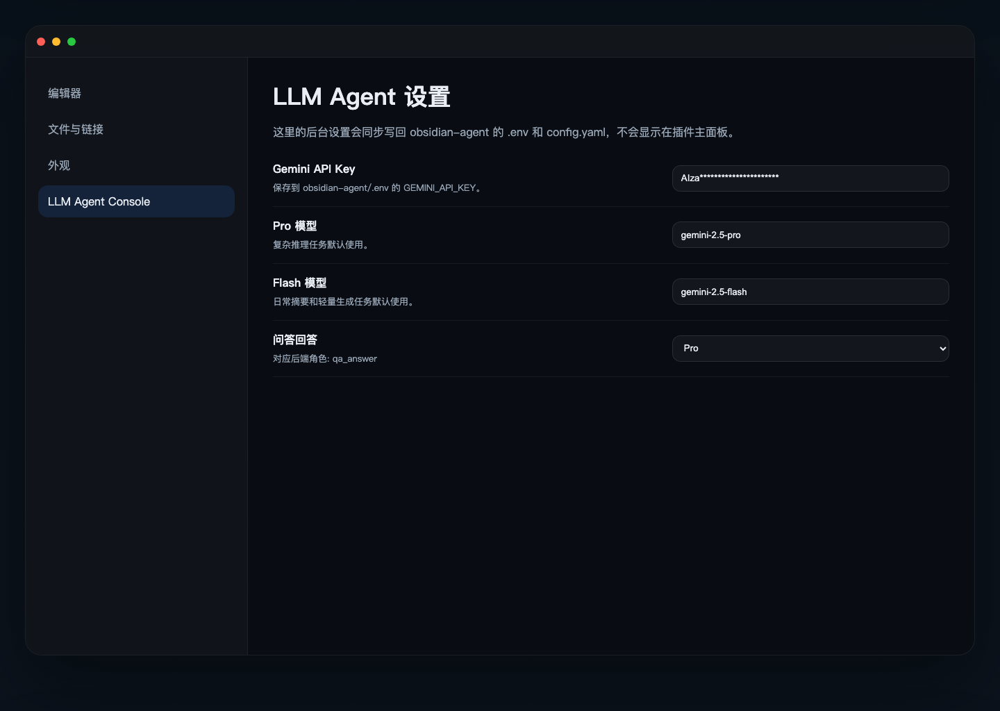
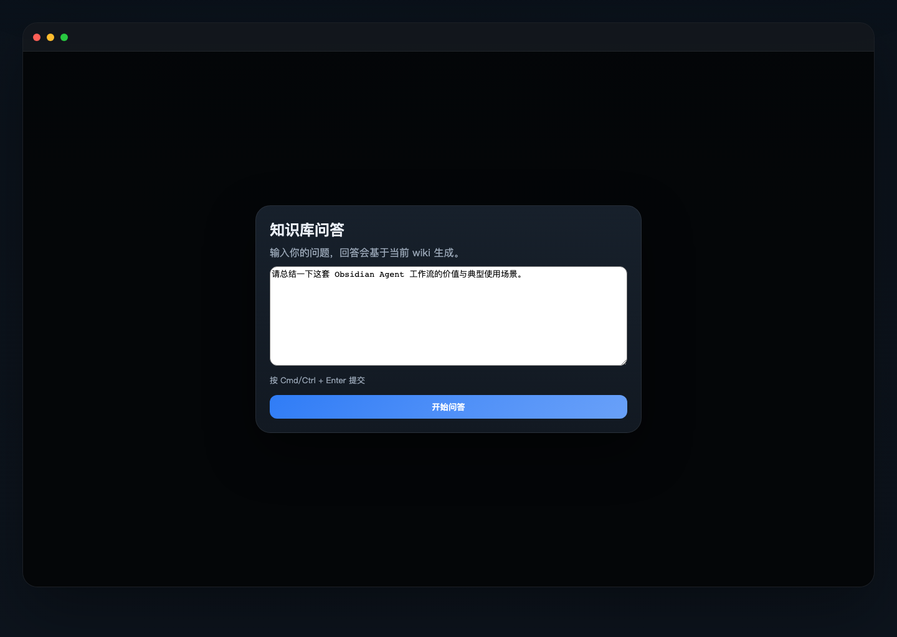

# 🧠 Obsidian Agent

基于 [Andrej Karpathy 的理念](https://x.com/karpathy/status/2039805659525644595)，用 LLM 自动维护你的 Obsidian 知识库。

这个仓库现在同时包含两部分：

- `obsidian-agent` 后端：负责 `ingest / compile / qa`
- `obsidian-llm-agent` Obsidian 插件：在 Obsidian 内直接触发这些能力

目标是让其他人 clone 仓库后，通过一条安装命令把后台、插件和基础目录一起配置好。

## 项目结构

```text
obsidian-agent/
├── config.yaml                    # 后端配置
├── .env.example                   # API Key 模板
├── package.json                   # 本地 Node 依赖（defuddle）
├── requirements.txt               # Python 依赖
├── docs/                          # 预览图和文档素材
├── plugins/
│   └── obsidian-llm-agent/        # Obsidian 插件源码
│       ├── manifest.json
│       ├── main.js
│       └── styles.css
└── scripts/
    ├── bootstrap_vault.sh         # 给全新 vault 安装插件和最小配置
    ├── ingest.py
    ├── compile.py
    ├── install.sh                 # 一键安装后台 + 插件 + vault 目录
    ├── link_icloud_roots.sh       # 把 iCloud 根目录下的知识库软链接到指定目录
    ├── qa.py
    └── utils.py
```

## 一键安装

### 1. 克隆仓库

```bash
git clone https://github.com/obsidian-llm-lab/obsidian-agent.git
cd obsidian-agent
```

### 2. 运行安装脚本

默认会把 vault 安装到仓库旁边的 `../obsidian`：

```bash
./scripts/install.sh
```

如果你想指定自己的 Obsidian vault 路径：

```bash
./scripts/install.sh /absolute/path/to/your-obsidian-vault
```

### 给全新空白 vault 安装插件

如果你只是新建了一个空的 Obsidian vault，想先把插件装进去，再在 Obsidian 里选择知识库模板，可以运行：

```bash
./scripts/bootstrap_vault.sh /absolute/path/to/your-empty-vault
```

路径里如果有空格也可以直接传，脚本会自动拼接成完整 vault 路径。

这个脚本会：

- 创建最小 `.obsidian/` 结构
- 安装 `obsidian-llm-agent` 插件
- 写入插件默认配置
- 自动把插件加入 `community-plugins.json`

然后你只需要在 Obsidian 里打开这个 vault，启用插件，再点击“初始化当前知识库”即可。

安装脚本会自动完成这些事情：

- 创建 `.venv`
- 安装 Python 依赖
- 安装本地 Node 依赖 `defuddle`
- 创建 Obsidian vault 所需目录
- 把插件复制到 `vault/.obsidian/plugins/obsidian-llm-agent/`
- 写入插件默认配置
- 将插件加入 `community-plugins.json`
- 如果 `.env` 不存在，则从 `.env.example` 生成
- 将 `config.yaml` 中的 `paths.vault_dir` 改成你的目标 vault 路径

## 安装后只需做两件事

### 1. 在 Obsidian 中启用插件

打开你的 vault，然后：

1. 进入 `Settings -> Community plugins`
2. 确认允许社区插件
3. 启用 `LLM Agent Console`

启用后，左侧会出现一个机器人图标，点击即可打开 `LLM Agent` 面板。

### 2. 在插件设置里配置 LLM

进入 `Settings -> Community plugins -> LLM Agent Console -> Options`，你可以直接在插件设置页里配置：

- `Gemini API Key`
- `Pro / Flash / Lite` 模型名
- 摘要、概念提取、索引、问答等任务分别使用哪档模型

这些设置会自动同步写回：

- `obsidian-agent/.env`
- `obsidian-agent/config.yaml`

如果你更习惯手动改文件，仍然可以直接编辑 `.env` 和 `config.yaml`。

## 在 Obsidian 里能做什么

插件面板当前支持：

- `初始化当前知识库`
- `摄取 URL`
- `增量编译`
- `查看编译状态`
- `知识库问答`

所有任务都直接在 Obsidian 内触发，不需要手动打开终端。

其中“初始化当前知识库”支持在当前 vault 里一键补齐推荐目录、README 和起步文件，适合快速创建新的独立知识库。

## 界面预览

### 插件主面板



### 插件设置页



### 知识库问答弹窗



## 默认生成的 vault 目录

```text
your-vault/
├── raw/
│   ├── articles/
│   ├── papers/
│   ├── code/
│   ├── images/
│   └── misc/
├── wiki/
│   ├── concepts/
│   ├── summaries/
│   └── relations/
└── output/
    ├── reports/
    ├── charts/
    └── slides/
```

## 后端命令

虽然推荐直接在 Obsidian 插件里使用，你仍然可以手动运行后端命令：

```bash
# 摄取网页
.venv/bin/python scripts/ingest.py url https://example.com/article

# 增量编译
.venv/bin/python scripts/compile.py

# 查看状态
.venv/bin/python scripts/compile.py --status

# 问答并保存报告
.venv/bin/python scripts/qa.py --save "什么是 RLHF？"
```

## 插件开发与同步

仓库中的插件源码位于 `plugins/obsidian-llm-agent/`。

如果你修改了插件源码，重新运行一次安装脚本即可把最新插件同步到目标 vault：

```bash
./scripts/install.sh /absolute/path/to/your-obsidian-vault
```

## iCloud 根目录软链接

如果你希望把 iCloud Drive 根目录下的多个知识库统一软链接到某个本地目录，方便在多台 Mac 上复用同一套 iCloud 同步能力，可以运行：

```bash
./scripts/link_icloud_roots.sh /absolute/path/to/your-link-directory
```

这个脚本会：

- 扫描 `~/Library/Mobile Documents/com~apple~CloudDocs`
- 自动排除 `Desktop`、`Documents` 和隐藏项
- 把其他一级目录软链接到你指定的位置

常用示例：

```bash
# 先预演，不真正创建
./scripts/link_icloud_roots.sh --dry-run ~/icloud-links

# 真正创建软链接
./scripts/link_icloud_roots.sh ~/icloud-links
```

如果你希望在同一个 Apple ID 的多台 Mac 之间同步多个知识库，可以进一步参考：

- [使用 Apple iCloud 在多台 Mac 之间同步知识库](docs/multi-mac-icloud-sync.md)

## 当前技术栈

- Python 后端
- Google Gemini API
- Obsidian Desktop 插件
- Node 本地依赖：`defuddle`

## 注意事项

- 这是桌面版 Obsidian 插件，移动端不可用
- 首次启用社区插件时，仍需要你在 Obsidian 里确认安全提示
- `.env` 不会提交到仓库，请自行保管 API Key
